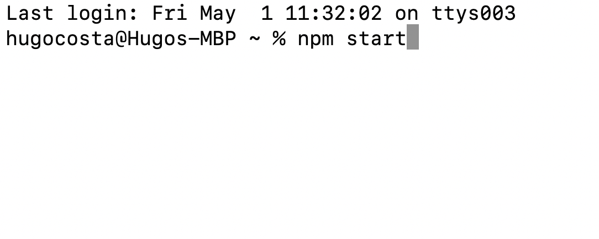

# EMPLOYEE TRACKER
 

## Description
 

 Easy to use CLI application that allows users to stay in track on their compny's information, such as :

<ul>
<li>Adding an Employee.</li>
<li>Viewing all employees and their current, ids, roles, departments, salaries and manhers, if they have one.</li>
<li>Delete Emplyees, Roles and Departments.</li>
<li>Update Employees and Managers.</li>
<li>Few more options.</li>
</ul>
 

## Installation
 

In order for you to install the app, you (the user), can simply fork this repo or do a git clone. From there, once you are inside index.js you can right click on the file and click on "Open in Terminal". On my previous applications we used "node [fileName]" to start the application, this one however I added a script to the package.json file which allows users to start the application using "npm start". The whole application is ran on the Terminal window, so as soon as the user starts the app, they will be prompted with options or input questions. Also at the end of every "transaction", the user will be given an option to exit or go back to the main menu... 

 

## Questions
 
<a href = "mailto:gohucosta23@hotmail.com">gohucosta23@hotmail.com</a> 